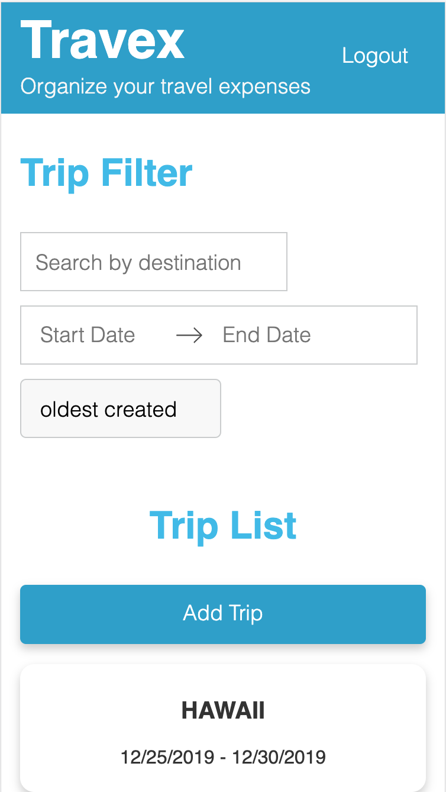
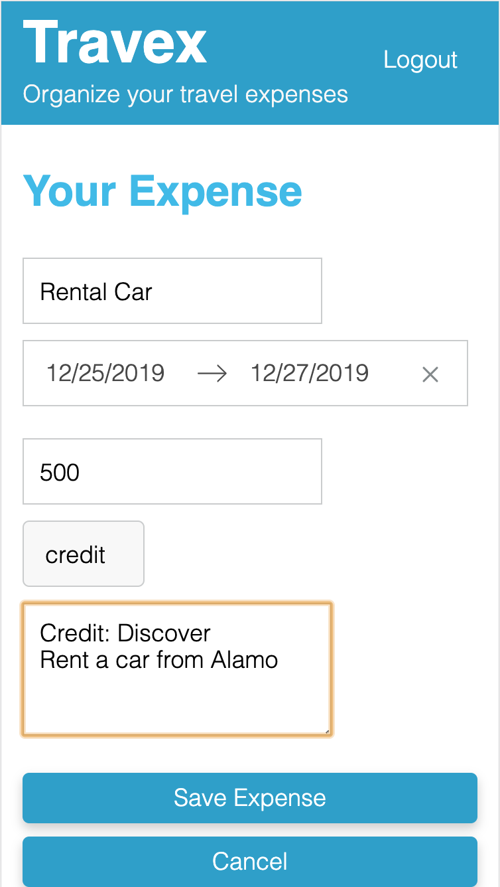

# Travex App

Simple and easy travel expenses managing app.

## Overview

Worked to teach myself fullstack development by creating this web application. Used React for client side, Redux to store the global states, and Node.js and Firebase for database persistence. 

This project is deployed by Heroku and you can check the live website from [here](https://travex-app.herokuapp.com).

 
